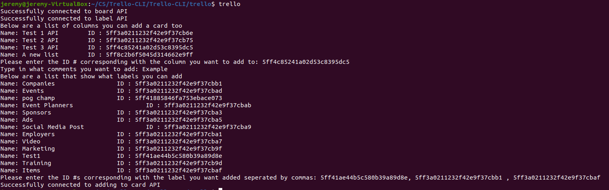

# Trello-CLI
A CLI Program that lets you add comments, labels directly into the Trello
website directly from a single command in the terminal. The program uses Click for it's CLI functionality


# Requirements
- Python3
- Pip3
- Venv(For Virtual Environment)

# Getting Started (No Virtual Environment)
1. Install by typing in terminal 
 - ``` git clone https://github.com/papaJCL/Trello-CLI.git``` 
2. Make sure you are in the correct directory in termianl 
- ```cd Trello-CLI/```
3. Build the project 
- ```pip3 install --editable .``` 
4. Open the keys.txt file in /trello directory and add your key, token, and board ID # from trello.(Example shown below)
5. Once in the trello directory type trello in the console ```trello``` and follow the instructions 
    - If the Terminal says it doesn't recognize the command "Trello" it means you need to add a $PATH line to your .bashrc file
        - Open up the .bashrc file in whichever editor you choose ```vi ~/.bashrc```
        - Add this line to the bottom of the file 
         - export PATH="$HOME/.local/bin:$PATH"
        
# Getting Started (With virtual Environment)
1. Install by typing in terminal 
 - ``` git clone https://github.com/papaJCL/Trello-CLI.git``` 
2. Make sure you are in the correct directory in termianl 
- ```cd Trello-CLI/```
3. Open up the virtual Environment by typing
- ```virtualenv env```
4. Build the venv by typing
- ```source venv/bin/activate```
3. Build the project 
- ```pip3 install --editable .``` 
4. Open the keys.txt file in /Trello directory and add your key, token, and board ID # from trello.(Example shown below)
5. Run the project
- ```cd trello/``` 
- ```trello``` 

# Keys.txt Layout
- First Line - key
- Second Line - token
- Third Line - boardID

# Example Output



# Time Taken
- Organizing and Planning(Finding what CLI I wanted to use and researching Trello API) 1-1.5 Hours
- Coding 2 Hours
- Cleanup and writing ReadME 45 Minutes
- Estimated Total ~4.5 hours


# Next Development Steps
- Make the UI easier to read in terminal
- Let users be able to type a number that is correleated to a specific ID instead of having to copy/paste the ID numbers
- Add functionality such as being able to remove labels, create brand new labels, create a board, remove a board, etc.
- Make it more modular by adding classes
